<!--
  ============================================================
  GitHub Profile README — Mixer159 (Maxim Kudela)

  Vizuální systém převzatý z chciweeeb.cz:
  bílá plocha, jeden akcent #0047FF, vlásková linka místo
  stínů, mono mikrotypografie, hodně vzduchu.
  Žádné pilulky, žádné trofeje, žádný had.

  Pozn.: oddělovače (---) tu schválně nejsou. GitHub kreslí
  pod každý nadpis h2 vlastní vlásku, takže by vedle sebe
  stály dvě linky a ta druhá je tlustá a šedá.
  Odstavec = jeden řádek ve zdroji. GitHub dělá z každého
  zalomení <br>, ručně zalámaný text by se pak lámal dvakrát.
  ============================================================
-->

<div align="center">
  
</div>

<br>

I'm 20, I work from Třinec in the Czech Republic, and I've been building for the web for six years. I run **[Chciweeeb.cz](https://chciweeeb.cz)**, a small studio that hand codes websites for Czech companies and sole traders, and afterwards I write the internal systems those companies run on.

No page here started as a template. Every project starts as an empty file.

## What I do.

**Websites on order.** Company sites, landing pages and smaller e-shops, written from scratch in Next.js. First message to launch takes three days to two weeks, depending on the scope.

**The system behind the website.** A site is the visible part. Most of my code is the other part: CRM, quoting, client portals, onboarding flows, audit trails, the machinery that keeps a business from running on a spreadsheet.

**Interfaces that hold up.** Type safe, accessible, fast on a phone on mobile data. A design that looks good in a screenshot and loads in four seconds is not a design.

## Chciweeeb.cz

My studio and my largest codebase. The public site is Next.js 16 on the App Router with React 19, Tailwind 4 and Framer Motion. Behind the login sits everything the studio actually runs on: leads and CRM, a price configurator, projects and delivery, a client portal, onboarding and intake forms, an audit trail, and an AI assistant that knows our own pricing rules.

Realtime data on Convex, transactional mail through Nodemailer, bot protection on the public endpoints, analytics that stay off until someone says yes, because Czech consent law is not a suggestion. Twenty plus sites shipped so far.

**[chciweeeb.cz](https://chciweeeb.cz)**

## Workeee

A Czech team workspace built around one flow: organization, then projects, then tasks. Kanban with custom states, a block editor, attachments, comments with mentions, role management, and one time invites for a whole organization or a single project.

Next.js 16 · React 19 · TypeScript · Tailwind 4 · Convex · Better Auth · tested with Vitest and convex-test

**[Repository](https://github.com/Mixer159/Workeee)** &nbsp;·&nbsp; **[Live app](https://workeee.vercel.app)**

## Selected work.

| Site | What it is |
|:--|:--|
| **[fitboost.me](https://fitboost.me)** | A fitness app for people who have quit training more than once, plus the page that sells it. One clear action per screen. |
| **[nejservis.eu](https://nejservis.eu)** | Window and door repair. The customer arrives with a specific problem, so the enquiry form sits on the first screen. |
| **[uversezastavou.cz](https://uversezastavou.cz)** | Loans against property. Trust decides here, so the page explains how it works before it asks for a phone number. |
| **[hotovehned.cz](https://hotovehned.cz)** | One page for property buyouts, one goal. Brief to launch in five days. |
| **[taiwanbusiness.eu](https://www.taiwanbusiness.eu/cs)** | A trade representation talking to two markets at once. Several language versions over one content base, not two sites side by side. |
| **[julcadoucko.cz](https://julcadoucko.cz)** | Private tutoring. Parents read how a lesson works and book it, instead of hunting for a phone number. |
| **[kudelamaxim.cz](https://kudelamaxim.cz)** | My portfolio, and the place where things get tested before a client ever sees them. |

Most of the rest lives in private client repositories, which is why this profile is quieter than my week.

## Stack.

```
Everyday     TypeScript · React 19 · Next.js 16 (App Router, RSC)
Interface    Tailwind CSS 4 · Framer Motion · shadcn/ui · Radix · Lucide
Backend      Convex · Better Auth · Node · Vercel · Nodemailer · Zod
Also         Python · FastAPI · Remotion · Git
```

I'm picky about two things. Everything is typed, and nothing ships before it has been read on a real phone.

## Currently.

Building an AI assisted intake flow that turns a client brief into a structured project spec, so a project starts with answers instead of a blank page. Next to that: a client portal where the customer watches their own project move, and a Remotion pipeline for short promo videos.

Away from the keyboard I mostly go looking for music I have not heard yet.

## Get in touch.

**Studio** &nbsp;·&nbsp; [chciweeeb.cz](https://chciweeeb.cz)
**Portfolio** &nbsp;·&nbsp; [kudelamaxim.cz](https://kudelamaxim.cz)
**Email** &nbsp;·&nbsp; [kudela.maxim@kudelamaxim.cz](mailto:kudela.maxim@kudelamaxim.cz)
**LinkedIn** &nbsp;·&nbsp; [Maxim Kudela](https://www.linkedin.com/in/maxim-kudela-18629921a/)
**X** &nbsp;·&nbsp; [@kudela_maxim](https://x.com/kudela_maxim)

Write to me about a website, about a system that should have been automated a year ago, or just about code. I answer within a day.

<br>

<sub>Postaveno v Třinci. Píšu weby, které někdo opravdu používá.</sub>

<!--
  ── Statistiky (schválně vypnuté) ──────────────────────────
  github-readme-stats má teď pauznutý deployment (vrací 503
  DEPLOYMENT_PAUSED), takže by z těch karet byly rozbité
  obrázky. Až se vrátí, stačí odkomentovat. Barvy už sedí na
  systém: bílá plocha, vlásková linka, jeden akcent.

  <div align="center">
    
    
  </div>

  Tohle funguje i teď — mřížka příspěvků v akcentu:

  <div align="center">
    
  </div>
  ───────────────────────────────────────────────────────────
-->
